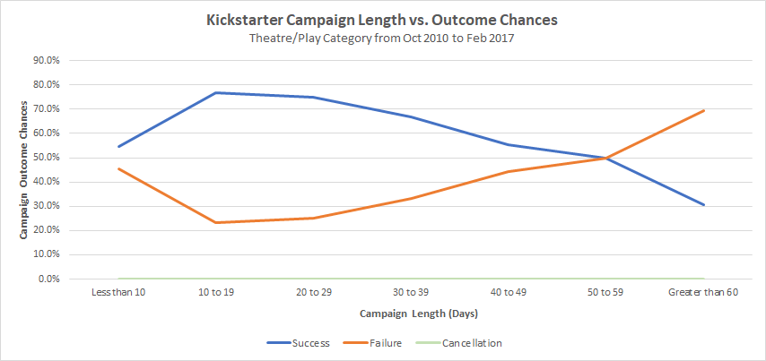

# An Analysis of Kickstarter Campaigns - Module 1 Lesson Drills
* Performing analysis on Kickstarter data to uncover trends in targeted campaign categories and countries
* The analysis focused on theater/plays campaign in the US, and musicals in Great Britain
## Challenge
### **Purpose:** 
An Analysis on Kickstarter campaigns to help Louise plan for the success of her play's fundraising campaign
### **Key Questions:**
* Does the goal amount have an impact on outcomes?
* Does campaign launch date have an impact on outcomes?
### **Data Source:**  
Kickstarter data for Theater and Theater/Play categories, mostly from Q4 2010 to Q1 2017.
### **Main Findings:**
1. Fundraising campaigns for plays have greater than 50% success chance if the goal amount is less than $15000.  Although there were 67% success rate cases for $35000-$45000 goal range, there were only 9 campaigns at that goal range in the data; we do not have enough information to draw meaning insights for those higher goal amount.
2. For play projects with goal amount <$15000, the success chance increase to >70% if the goal amount is less than $5000, which is half of Louise's proposed goal of $10000.   Louise needs to weigh her options whether to keep the current proposed goal or lower her goal to increase her chances of success in fundraising.

3. In Theater fundraising campaigns, May is the peak project launch month in the data, with approximately 67% success rate.  Overall, May through July have more of theatre projects launches with higher success outcomes.  However, this also means more competitions for funds during those months.
4. At the end of year, particularly in December, is not a good time to launch a fundraising project because success-failure rate is almost 50-50, and less projects are launched in December.

### **Limitations and Further Analysis**
1. The analysis required for the challenge does not address a key question relating to the length of campaigns and outcomes.  To perform such analysis, we need to first create a campaign length variable by subtracting end date to launch date, then graph it against outcome chances. As the graph indicates below, campaigns with less than 30 days tend to be more successful.

2. The Kickstarter data only has Category and Subcategory.  Different genres of play might play a role in the outcomes but currently we cannot drill down to that level of insight.
3. The Kickstarter data only captures geographic information at the Country level.  There might be geographical/metropolitan area factors influencing people's interest in supporting Theater-related projects.  This might be important to Louise for targeting her potential supporters.
4. There might be other lurking variables that are correlated to the goal amounts and launch dates that we analyzed.  For example, the lower goal amounts might be due to theater projects predominantly for smaller community theaters in the data and not bigger productions possibly for Broadway/off-Broadway, and Louise might be planning for a bigger production.
5. Although the goal and pledged amount are in US dollars, the Kickstarter data includes theater projects from other countries, which might introduce other cost factors that are not relevant to US projects but nevertheless influence the findings.
